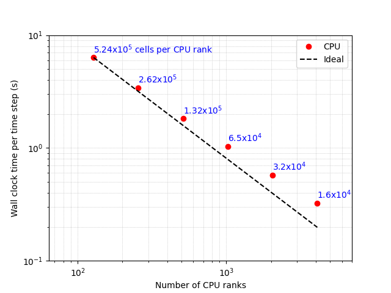
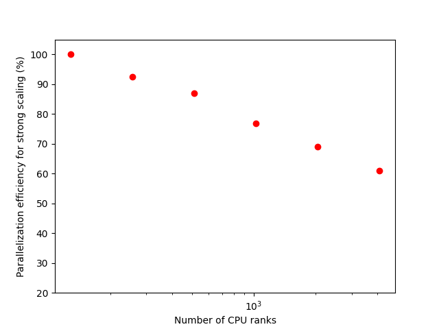
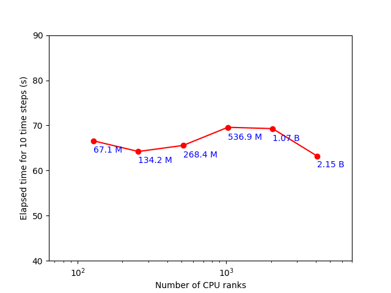
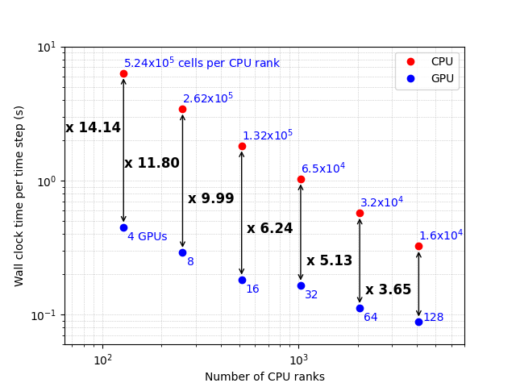
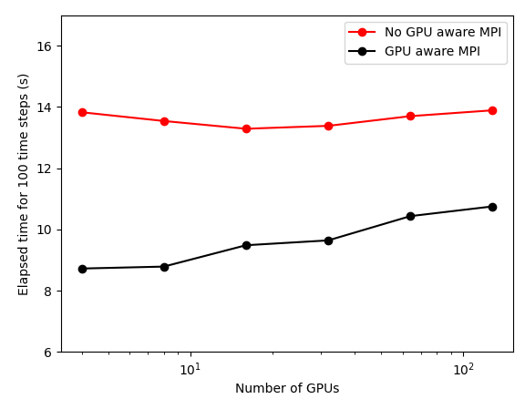

 .. role:: cpp(code)
    :language: c++

 .. _Performance:

Scaling results
================

To assess the performance of the ERF code on CPUs and GPUs, strong and weak scaling studies were completed. The ABL simulation was chosen for the scaling studies since it is representative of a typical atmospheric flow simulation. The scaling was performed on the CPU and GPU nodes on Perlmutter -- a supercomputer hosted at the National Energy Research Scientific Computing Center (NERSC), which is located at Lawrence Berkeley National Laboratory (Berkeley Lab). A single CPU node consists of 128 AMD EPYC 7763 (Milan) cores while a GPU node has 64 AMD EPYC 7763 (Milan) cores and 4 NVIDIA A100 (Ampere) GPUs. In all simulations, the domain has lengths :math:`(L_x, L_y, L_z) = (2048, 2048, 1024)` [m].

For the strong scaling study, a fixed mesh size of :math:`(N_x, N_y, N_z) = (512, 512, 256)` is employed, and a 128-core simulation is taken as the reference. Subsequent simulations were completed by doubling the number of cores until 4096. For CPU-only simulations, the observed strong scaling timings are illustrated in the figure below, while the parallelization efficiency, defined as:

.. math::
    E = \left( \frac{T}{T_\text{128}} \right) \left( \frac{128}{N} \right) \times 100 \%,

is shown in the figure below. In the above, N is the number of cores and T is the time taken per time step. At 2048 cores, and ~32^3 cells per rank, the parallel efficiency is 69%. On GPU nodes, the number of CPU ranks is held constant at 4 --- i.e., each rank offloads its work to a single GPU. Therefore, the speed-up presented here between GPU and CPU is per node, rather than per rank. On node, speed-ups of 5--15x are achieved up to 16 GPU nodes, as shown in the figure below.

A weak scaling test was performed on CPUs with a mesh size of :math:`(512,512,256) = 67.1` million, on 1 node (128 MPI ranks), and the number of cells was progressively scaled to :math:`(4096,2048,256) = 2.1` billion, on 32 nodes (4096 MPI ranks). Excellent weak scaling is shown by the nearly constant timings, for 10 iterations, as in figure below.

A weak scaling test was also performed on GPUs with a mesh size of :math:`(256,256,512)` on 1 GPU node, and the number of cells was progressively scaled to :math:`(2048,1024,512)` on 32 nodes. The total elapsed time for 100 iterations with and without GPU-aware-MPI is shown in figure below. The nearly constant timings show excellent weak scaling and the benefits of GPU-aware-MPI are clearly observed with the 25-35% speed-up.

   **Strong scaling on CPUs. The number of mesh cells per rank is shown in blue.**

   **Parallelization efficiency for strong scaling.**

   **Weak scaling on CPUs. The total number of mesh cells is shown in blue.**

   **Comparison of timings on CPU and GPU showing the speed-up factor. We compare a CPU node with 128 ranks to a GPU node with 4 ranks, so there are 32x more points per GPU than per CPU core. Points on the same vertical line represent the same number of nodes.**

   **Weak scaling on GPUs with and without GPU-aware MPI.**
